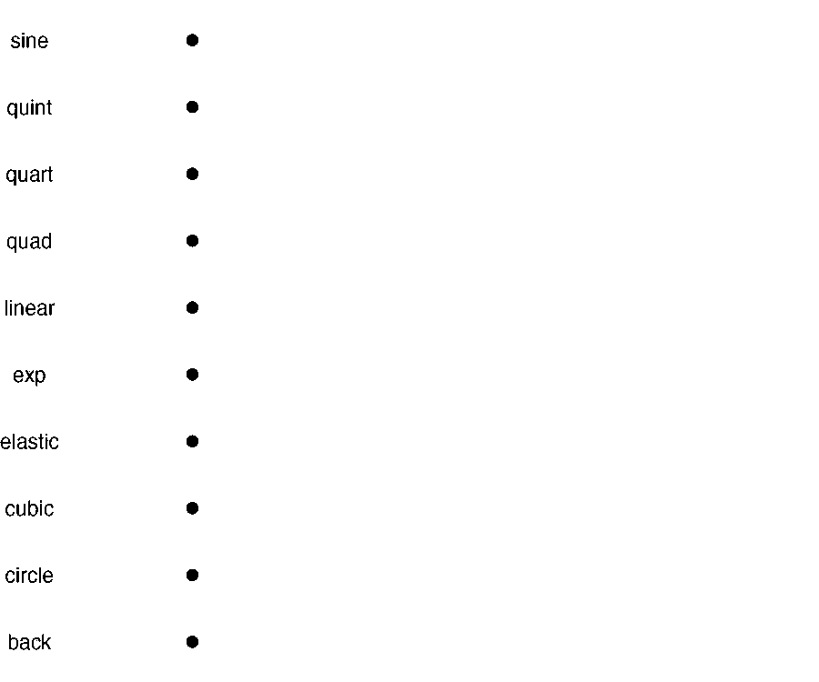

<!-- README.md is generated from README.Rmd. Please edit that file -->

```{r, include = FALSE}
knitr::opts_chunk$set(
  collapse = TRUE,
  comment = "#>",
  fig.path = "man/figures/README-",
  out.width = "100%"
)

library(displease)
```

# displease

<!-- badges: start -->

[](https://github.com/coolbutuseless/displease/actions/workflows/R-CMD-check.yaml)
<!-- badges: end -->

The `displease` package provides non-linear interpolation between numeric values.  

It is a replacement for `seq()` for when you want a sequence between two values which is **not** equally spaced.

Easing can look much better than strict linear interpolation when applied  to 
objects moving spatially.

`displease` = **displ** + **ease**. The results are often used for 
animating visual **displacement**, and the non-linear interpolation is 
performed by applying an **easing** function.


## Installation

You can install from [GitHub](https://github.com/coolbutuseless/displease) with:

``` r
# install.package('remotes')
remotes::install_github('coolbutuseless/displease)
```

## What's in the box?

* `seq_ease(x1, x2, n, type, direction)` - create a sequence of length `n`
   between `x1` and `x2`. Apply the easing function given by `type`.
    * `type` is one of: `sine`, `quad`, `cubic`, `quart`, `quint`, `exp`, 
  `circle`, `back`, `elastic`
    * `direction` is one of: `in`, `out`, `in-out`
* `seq_color(col1, col2, ...)` non-linear interpolation between two colors.

The following graph shows the `seq_ease()` output for `n = 100` for
all the different easing functions with given extents of `x1 = 0` and `x2 = 1`

## Displacement Easing


```{r example}
library(displease)

# normal linear interpolation using seq()
(y_linear       <- seq(1, 10, length.out = 10))

# Non-linear interpolation using {displease}
(y_cubic_in     <- seq_ease(1, 10, n=10, type = 'cubic', direction = 'in'))
(y_cubic_in_out <- seq_ease(1, 10, n=10, type = 'cubic', direction = 'in-out'))

plot(1:10, y_linear      , type = 'b')
plot(1:10, y_cubic_in    , type = 'b')
plot(1:10, y_cubic_in_out, type = 'b')
```

### Illustration of supported easings

```{r echo=FALSE, fig.height = 10}
suppressPackageStartupMessages({
  library(dplyr)
  library(ggplot2)
  library(purrr)
})


type   <- c('sine', 'quad', 'cubic', 'quart', 'quint', 'exp', 'circle', 'back', 'elastic')
direction <- c('in', 'out', 'in-out')

df <- as_tibble(expand.grid(type = type, direction = direction)) 

df <- purrr::map2_dfr(df$type, df$direction, 
                      ~tibble(
                        type = .x, 
                        direction = .y, 
                        x = 1:100, 
                        y = seq_ease(type = .x, direction = .y)))


ggplot(df) + 
  geom_line(aes(x, y)) + 
  facet_grid(type ~ direction) + 
  theme_bw() + 
  scale_y_continuous(name = NULL, breaks = c(0, 1)) + 
  scale_x_continuous(name = NULL, breaks = c(0, 100)) +
  theme(axis.title = element_blank(), axis.text.x = element_blank()) + 
  coord_fixed(50)

```


## Easing between two colors

When easing between two colors, the `colorspace` where the interpolation takes
place will have a large effect on the final result.

The examples below show the interpolation from 'red' to 'blue'.  The only difference
between the examples is the colorspace where the interpolation occurs.

```{r fig.height = 1}
n <- 100
cols <- seq_color('red', 'blue', n = n, direction = 'in-out', type = 'cubic',
                  colorspace = 'hcl')
head(cols)
grid::grid.rect(x = seq(0, 0.95, length.out = n), width = 0.1, 
                gp = grid::gpar(fill = cols, col = NA))
```


```{r fig.height = 1}
n <- 100
cols <- seq_color('red', 'blue', n = n, direction = 'in-out', type = 'cubic', 
                  colorspace = 'lab')
head(cols)
grid::grid.rect(x = seq(0, 0.95, length.out = n), width = 0.1, 
                gp = grid::gpar(fill = cols, col = NA))
```


## Animated example

This animation shows each of the easing types.

```{r eval = FALSE, echo = FALSE}
library(dplyr)
library(ggplot2)

N <- 50
linear  = seq(0, 1, length.out = N)
sine    = seq_ease(0, 1, n=N, type = 'sine'   , direction = 'in-out')
quad    = seq_ease(0, 1, n=N, type = 'quad'   , direction = 'in-out')
cubic   = seq_ease(0, 1, n=N, type = 'cubic'  , direction = 'in-out')
quart   = seq_ease(0, 1, n=N, type = 'quart'  , direction = 'in-out')
quint   = seq_ease(0, 1, n=N, type = 'quint'  , direction = 'in-out')
exp     = seq_ease(0, 1, n=N, type = 'exp'    , direction = 'in-out')
circle  = seq_ease(0, 1, n=N, type = 'circle' , direction = 'in-out')
back    = seq_ease(0, 1, n=N, type = 'back'   , direction = 'in-out')
elastic = seq_ease(0, 1, n=N, type = 'elastic', direction = 'in-out')

df <- data.frame(
  idx = seq_len(N * 2),
  linear  = c(linear , rev(linear )),
  sine    = c(sine   , rev(sine   )),
  quad    = c(quad   , rev(quad   )),
  cubic   = c(cubic  , rev(cubic  )),
  quart   = c(quart  , rev(quart  )),
  quint   = c(quint  , rev(quint  )),
  exp     = c(exp    , rev(exp    )),
  circle  = c(circle , rev(circle )),
  back    = c(back   , rev(back   )),
  elastic = c(elastic, rev(elastic))
)

mdf <- tidyr::gather(df, type, value, -idx)

dir.create('man/figures/anim/', showWarnings = FALSE)
zz <- list.files('man/figures/anim/', full.names = TRUE)
unlink(zz)

alpha <- c(
  '0' = 1,
  '1' = 0.15,
  '2' = 0.1,
  '3' = 0.07,
  '4' = 0.03,
  '5' = 0.02,
  '6' = 0.01
)

create_plot <- function(this_idx) {
  plot_df <- mdf %>% 
    filter(idx <= this_idx, this_idx - idx <= 5) %>%
    mutate(lag = as.character(this_idx - idx))
  p <- ggplot(plot_df) + 
    geom_point(aes(value, type, alpha = lag), size = 3, stroke = NA) + 
    theme_void() + 
    xlim(-0.2, 1.2) + 
    theme(
      axis.text.y = element_text(),
      legend.position = 'none'
    ) + 
    scale_alpha_manual(values = alpha)
  
  filename <- sprintf("man/figures/anim/%03i.png", this_idx)
  ggsave(filename, p, width = 6, height = 5)
  p
}

seq_len(N*2) %>% purrr::walk(create_plot)


# system.time({ system("convert man/figures/anim/*.png man/figures/anim.gif") })
# system.time({ system("gifski --fast --fps 10 man/figures/anim/*.png --output man/figures/anim2.gif")})
system.time({ system("gifski --fps 10 man/figures/anim/*.png --output man/figures/anim2.gif")})
system("gifsicle -k 16 -O99 man/figures/anim2.gif -o man/figures/anim3.gif")
```





