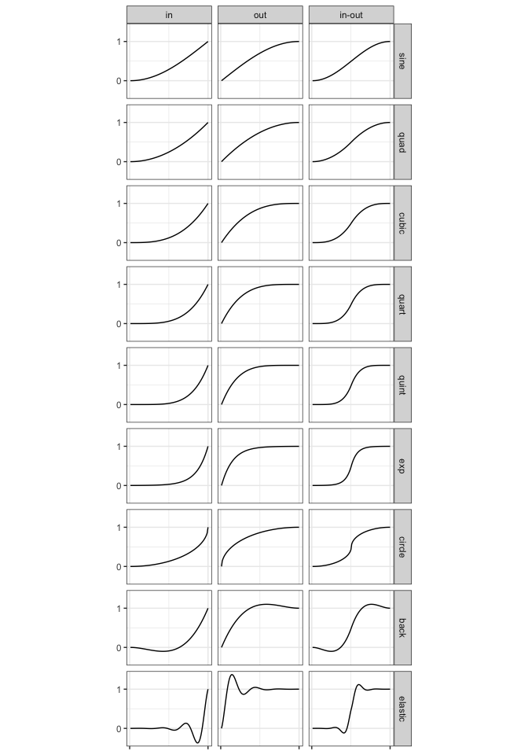
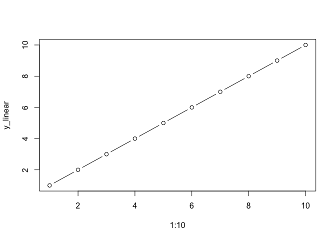
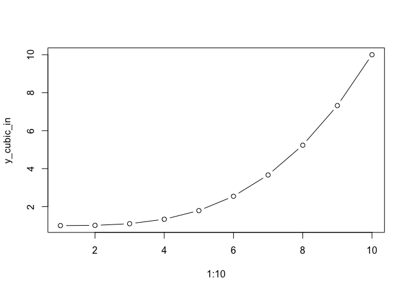
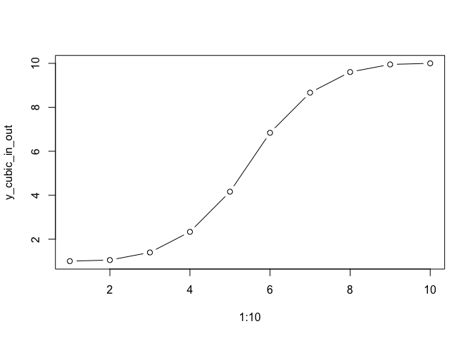

<!-- README.md is generated from README.Rmd. Please edit that file -->

# displease

<!-- badges: start -->


<!-- badges: end -->

The `displease` package provides non-linear interpolation between
numeric values.

It is a replacement for `seq()` for when you want a sequence between two
values which is **not** equally spaced.

Easing can look much better than strict linear interpolation when
applied to objects moving spatially.

`displease` = **displ** + **ease**. The results are often used for
animating visual **displacement**, and the non-linear interpolation is
performed by applying an **easing** function.

## Installation

You can install from
[GitHub](https://github.com/coolbutuseless/displease) with:

``` r
# install.package('remotes')
remotes::install_github('coolbutuseless/displease)
```

## What’s in the box?

- `seq_ease(x1, x2, n, type, direction)` - create a sequence of length
  `n` between `x1` and `x2`. Apply the easing function given by `type`.
- `type` is one of: `sine`, `quad`, `cubic`, `quart`, `quint`, `exp`,
  `circle`, `back`, `elastic`
- `direction` is one of: `in`, `out`, `in-out`

The following graph shows the `seq_ease()` output for `n = 100` for all
the different easing functions with given extents of `x1 = 0` and
`x2 = 1`



## Example

``` r
library(displease)

# normal linear interpolation using seq()
(y_linear       <- seq(1, 10, length.out = 10))
#>  [1]  1  2  3  4  5  6  7  8  9 10

# Non-linear interpolation using {displease}
(y_cubic_in     <- seq_ease(1, 10, n=10, type = 'cubic', direction = 'in'))
#>  [1]  1.000000  1.012346  1.098765  1.333333  1.790123  2.543210  3.666667
#>  [8]  5.234568  7.320988 10.000000
(y_cubic_in_out <- seq_ease(1, 10, n=10, type = 'cubic', direction = 'in-out'))
#>  [1]  1.000000  1.049383  1.395062  2.333333  4.160494  6.839506  8.666667
#>  [8]  9.604938  9.950617 10.000000

plot(1:10, y_linear      , type = 'b')
```



``` r
plot(1:10, y_cubic_in    , type = 'b')
```



``` r
plot(1:10, y_cubic_in_out, type = 'b')
```



## Animated example

This animation shows each of the easing types.


## Related Software

- [tweenr](https://github.com/thomasp85/tweenr) is a more general
  purpose package for interpolation
